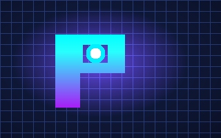

# ⚡ PSEUDOKO — Tactical Logic Strategy Game
> **InfinityPlay Strategy Master Title** • *Pure Client-Side Web Architecture*



Welcome to **PSEUDOKO**, an addictive, high-stakes 8×8 cyberpunk tactical strategy and logic puzzle game. 

PSEUDOKO blends the deep spatial deduction of Sudoku with territory control mechanics, harmonic circuit resonance combos, special cyber-nodes (Power Cores, Encrypted Firewalls, Vortex Conduits), and an adaptive heuristic AI.

---

## 🚀 Quick Start (Play Immediately)

### Option 1: Direct Browser Play (Zero Install)
Double-click `start-game.bat` or open `index.html` in **Google Chrome**, **Microsoft Edge**, **Mozilla Firefox**, or **Safari**.  
*No server, no terminal, and no internet connection required.*

### Option 2: Run with any Local Server
If you prefer running via HTTP:
- **Node.js**:
  ```bash
  npx serve .
  ```
- **Python**:
  ```bash
  python -m http.server 3000
  ```
- **VS Code**: Right-click `index.html` and choose **"Open with Live Server"**.

---

## 🎮 Game Modes

1. **🗺 Campaign Mode (100 Handcrafted Sectors)**
   - 5 Progression Tiers: *Beginner (1–10)*, *Easy (11–25)*, *Medium (26–50)*, *Hard (51–75)*, and *Master Singularity (76–100)*.
   - Dynamic move limits, target score thresholds, firewall obstacles, and star ratings (1 to 3 stars per sector).

2. **🤖 Adaptive AI Tactical Skirmish**
   - Duel against the built-in local minimax heuristic strategy AI engine.
   - 5 Difficulty Profiles: *Easy*, *Medium*, *Hard*, *Expert*, and *Singularity Master*.
   - Evaluates territorial heatmaps, harmonic circuit formation, constraint pressure, and counter-play.

3. **🌌 Procedural Endless Mode**
   - Infinite escalating waves with randomized constraint fields, power cores, and firewall layouts.
   - Trigger cascading harmonic circuit resonances to clear the board and achieve high scores.

4. **📅 Daily Challenge & Streak Protocol**
   - Deterministically generated puzzle based on the current calendar date (UTC).
   - Equal playing field for all players worldwide every 24 hours. Tracks consecutive daily victory streaks.

5. **🏆 16 Strategic Achievements**
   - Unlockable trophies with custom badges, XP points, and instant toast notifications.

6. **📊 Real-time Statistics & HUD**
   - Tracks games played, win rate, total score, campaign stars (out of 300), cores captured, and circuits completed.

---

## 🕹 Core Rules & Mechanics

- **The 8×8 Matrix**: The board consists of 64 cells divided into sixteen 2×2 Sectors.
- **4 Energy Frequencies**:
  - **α Alpha** (Cyber Cyan)
  - **β Beta** (Neon Purple)
  - **γ Gamma** (Electric Blue)
  - **δ Delta** (Laser Pink)
- **Constraint Deduction**:
  1. No duplicate frequencies within any 2×2 Sector.
  2. No two identical frequencies may be placed directly adjacent (orthogonally).
- **Harmonic Circuits**:
  Uniting all 4 unique frequencies (α, β, γ, δ) within a 2×2 sector or along a 4-node line conduit triggers a **Harmonic Circuit Resonance**! This locks the nodes, grants permanent territory influence, awards massive combo multipliers, and returns +1 bonus move.
- **Special Strategic Cells**:
  - ⚡ **Power Core**: Grants +300 points, radiates permanent quadrant influence, and recharges +1 move when occupied.
  - 🛡 **Encrypted Firewall**: Shields cells from standard placements. Bypass with parity harmonic alignment or use your EMP ability.
  - 🌀 **Vortex Conduit**: Radiates influence diagonally across the entire grid.
- **Tactical Abilities**:
  - 🔍 **Scan**: Computes mathematically optimal placement vectors.
  - ⚡ **EMP**: Disintegrates firewalls and resets compromised sectors.
  - ↺ **Undo**: Reverses previous moves.

---

## 📦 Package Structure

```
pseudoko/
├── index.html                  # Main responsive single-page game UI (12 screens)
├── README.md                   # Game documentation & quick start guide
├── start-game.bat              # 1-click Windows launcher
├── assets/                     # High-res vector graphics & UI emblems
│   ├── logo_pseudoko.svg       # Brand icon & favicon
│   ├── thumb_pseudoko.svg      # Cybernetic 8x8 emblem vector
│   ├── thumb_pseudoko.png      # High-res raster thumbnail
│   ├── top_pseudoko.svg        # Wide category banner vector
│   └── top_pseudoko.png        # Wide category banner image
├── css/                        # Modular stylesheet architecture
│   ├── pseudoko-theme.css      # Cyberpunk color palette, variables, animations
│   ├── pseudoko-board.css      # 8x8 matrix, cells, nodes, circuit connections
│   ├── pseudoko-screens.css    # 12 distinct game screens & modal overlays
│   └── pseudoko-responsive.css # Mobile/tablet touch controls & adaptive layout
└── js/                         # Zero-dependency modular JS engine
    ├── pseudoko-core.js        # Board state, 8x8 matrix rules, constraint validation
    ├── pseudoko-levels.js      # 100 progressive handcrafted campaign levels
    ├── pseudoko-ai.js          # 5-tier adaptive minimax heuristic strategy AI
    ├── pseudoko-audio.js       # Synthesized Web Audio API sound generator
    ├── pseudoko-storage.js     # Robust LocalStorage persistence & save manager
    ├── pseudoko-daily.js       # Deterministic date-seeded daily puzzle generator
    ├── pseudoko-endless.js     # Procedural infinite wave generation system
    ├── pseudoko-achievements.js# 16-trophy achievement engine
    ├── pseudoko-ui.js          # Screen transitions, DOM rendering & interactions
    └── pseudoko-app.js         # Master orchestrator & lifecycle coordinator
```

---

## 💎 Zero External Dependencies

- **Pure Vanilla JavaScript (ES6+)**: No React, Vue, Angular, or jQuery runtime required.
- **Synthesized Web Audio**: Procedurally generates sound effects, clicks, error buzzes, power core hums, and victory fanfare using the browser's native `AudioContext`.
- **Pure CSS3**: Smooth 60fps animations, glassmorphism backdrops, and responsive grid layouts.
- **Storage**: Native `localStorage` for offline persistence.

